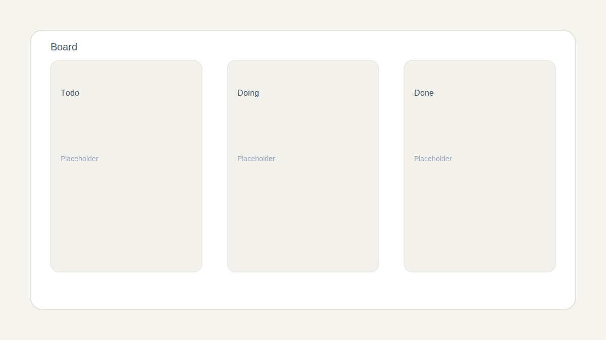
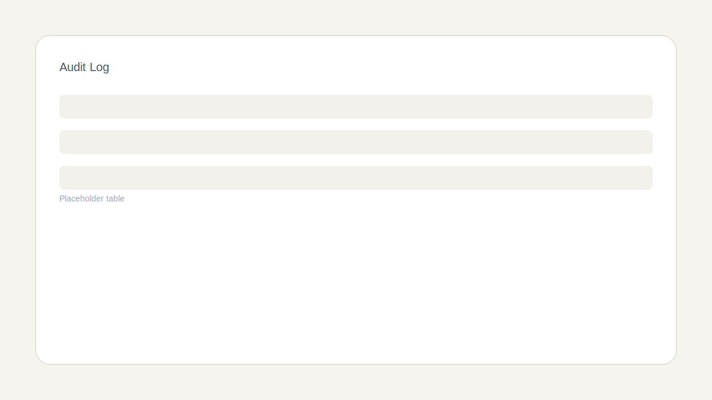
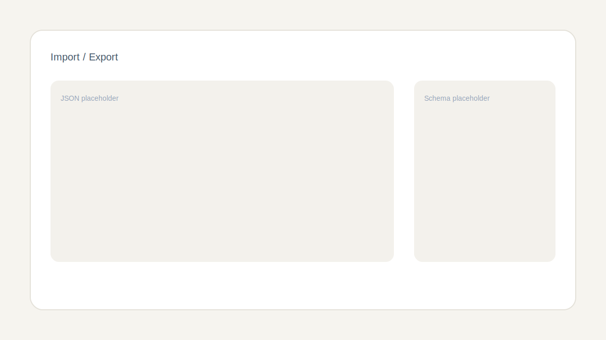

# Kanban Audit Lab

## Objetivo
Mini gestor Kanban para un equipo de trading con auditoría detallada, búsqueda avanzada con operadores, import/export validado y un Modo Dios para rúbricas y observaciones.

## Cómo usar
1. Instala dependencias: `npm install`
2. Arranca dev: `npm run dev`
3. Abre `http://localhost:3000`

## Capturas

## Deploy
Vercel: `https://vercel.com/tu-link-aqui`

## Checklist de requisitos
- [x] Next.js App Router + TypeScript
- [x] shadcn/ui (Radix) con Dialog, Form, Select, Badge, Tabs, Table, Toast/Sonner, AlertDialog
- [x] @dnd-kit drag & drop + alternativa accesible por teclado
- [x] Zod + react-hook-form con validación (sin `any`)
- [x] Persistencia en localStorage + export/import JSON
- [x] Resolución de IDs duplicados con auditoría
- [x] Auditoría con diff before/after + filtros + copiar resumen
- [x] Modo Dios con rúbricas 0–10, observaciones y panel resumen
- [x] Búsqueda avanzada con operadores y parser dedicado
- [x] Feature sorpresa: Time Travel (experimental)
- [x] Dataset inicial creíble (equipo de trading)

## Decisiones técnicas
- Reducer local con acciones explícitas para centralizar auditoría y evitar estado global pesado.
- `computeTaskDiff` genera diffs parciales para auditoría y permite resaltar cambios recientes.
- Parser de búsqueda tolerante con errores suaves y filtrado por tags, prioridad, estimación y vencimientos.
- Importación validada con Zod; los IDs duplicados se regeneran y se registran en auditoría.
- Time Travel revierte eventos en orden inverso; los imports guardan snapshot previo en `diff.note` para reconstrucción.

## Estructura mínima
- `app/page.tsx` shell principal
- `src/types.ts` modelos y schemas Zod
- `src/lib/storage.ts` persistencia + export/import
- `src/lib/query.ts` parser de búsqueda
- `src/lib/audit.ts` helpers de auditoría
- `src/components/...` UI y feature modules
